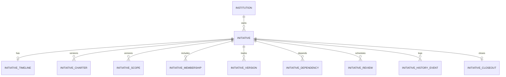

# Entity Relationship Model

**Build:** 11.1 · **Wave:** W2 · **Canonical:** [02_DATA_MODEL.md](02_DATA_MODEL.md)

## Cardinality

| From | To | Cardinality |
|------|-----|-------------|
| Institution | Initiative | 1:N |
| Initiative | Charter | 1:N (one active_version) |
| Initiative | Scope | 1:N (current by version) |
| Initiative | Timeline | 1:1 |
| Initiative | Membership | 1:N |
| Initiative | Version | 1:N |
| Initiative | Dependency | 1:N |
| Initiative | Review | 1:N |
| Initiative | HistoryEvent | 1:N append-only |
| Initiative | Closeout | 0:1 (terminal states) |
| Initiative | Objective | 1:N (11.2) |
| Initiative | Workstream | 1:N (11.3) |

## Ownership (Embedded + Membership)

Executive and operational owners are stored on `InitiativeRecord` **and** reflected in `InitiativeMembershipRecord` for authority resolution. At most one active `operational_owner` membership.

## Cross-Institution

- `institution_id` on Initiative = governing institution only
- Participating Humans carry their home `institution_id` on membership
- Coalition initiatives add COL-001 records; host does not own participant institution data

## Diagram

Contract: `data/phase-11/initiative_entity_schema.json`
